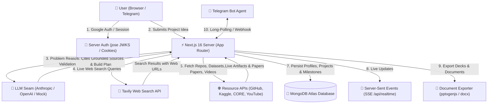

# 💡 IdeaForge — AI-Powered Project Research & Build-Plan Copilot

> **From a one-line project idea to a validated, cited, and actionable technical build plan in ~4 minutes.**

🌐 **Live Demo**: [https://ideaforge-2e1m.onrender.com](https://ideaforge-2e1m.onrender.com)

---

## 📋 Table of Contents
1. [Overview](#-overview)
2. [Problem Statement](#-problem-statement)
3. [Solution](#-solution)
4. [Key Features](#-key-features)
5. [System Architecture](#-system-architecture)
6. [AI Agent Architecture & Workflows](#-ai-agent-architecture--workflows)
7. [Technology Stack](#-technology-stack)
8. [Project Directory Structure](#-project-directory-structure)
9. [Database Architecture](#-database-architecture)
10. [Authentication & Security](#-authentication--security)
11. [API Reference](#-api-reference)
12. [Prerequisites](#-prerequisites)
13. [Environment Variables](#-environment-variables)
14. [Local Development & Setup](#-local-development--setup)
15. [Testing & Quality Evaluation](#-testing--quality-evaluation)
16. [Deployment](#-deployment)
17. [Major Technical Decisions & Challenges](#-major-technical-decisions--challenges)
18. [Future Roadmap](#-future-roadmap)
19. [License](#-license)

---

## 🎯 Overview

**IdeaForge** is an AI-powered research and innovation copilot designed for hackathon participants, students, researchers, and first-time founders. It bridges the gap between having a raw project idea and knowing whether it is worth building—and how to execute it—in under 4 minutes.

Unlike generic conversational AI tools, IdeaForge grounds its analysis in **live web search results (Tavily)** and real external resources (open-source code on **GitHub**, datasets on **Kaggle**, academic preprints on **CORE / arXiv**, and tutorial videos on **YouTube**). It enforces strict citation integrity, rejecting invented URLs and providing deterministic scoring and structured technical build plans.

---

## 🚨 Problem Statement

1. **Unbounded & Exhaustive Research**: Builders spend 1–2 weeks opening 40+ browser tabs to perform market research, evaluate incumbents, and figure out tech stacks.
2. **AI Hallucinations & Unverifiable Links**: Generic LLMs confidently output fabricated web links, dead GitHub repositories, or fake citations.
3. **Flattery vs. Honest Evaluation**: Traditional AI chatbots approve almost any project idea, leading builders to waste months on over-crowded markets or mild, low-severity problems.
4. **Lack of Actionable Execution Plans**: Raw chat outputs do not provide structured milestone roadmaps, explicit tech stack rationales, or exportable deliverables (like pitch decks or Word documents).

---

## 💡 Solution

IdeaForge provides an automated, end-to-end pipeline that takes a single sentence and executes a multi-phase research & planning workflow:

- **Honest Severity Scoring**: Pushes back on weak, unhelpful, or over-saturated ideas with an explicit 1–10 Severity rating before any code is written.
- **Grounded Web Research with Zero Link Hallucinations**: Runs live web searches via Tavily, handing numbered source snippets to the LLM. The LLM cites claims with `[n]` markers, and the server constructs the citation list directly from real search results.
- **Resource Extraction**: Automatically queries specialized APIs (GitHub, Kaggle, CORE/arXiv, YouTube) to find real repositories, datasets, academic literature, and tutorial videos.
- **Actionable Build Roadmap**: Synthesizes a domain-tailored technical plan containing tech stack rationales, architecture components, time-boxed milestones with deliverables, and external APIs.
- **Multi-Channel Delivery & Export**: Work can be managed interactively via an in-app console or Telegram Bot (`/status`, `/next`, `/plan`), exported in 1-click to Microsoft PowerPoint (`.pptx`), Word (`.docx`), PDF, or Markdown, and shared with team members.

---

## ⭐ Key Features

| Feature | Description |
|---|---|
| **Problem Validation** | Restates the problem as a job-to-be-done, scores severity (1–10), identifies affected target users and economic buyers, lists evidence signals, and suggests a narrow v1 scope. |
| **DeepSearch Research** | Executes live multi-query web searches, writes a grounded briefing with `[n]` citation markers, identifies existing market incumbents with strengths/gaps, and highlights market opportunities. |
| **Project HUB Build Plan** | Generates a complete project blueprint with tech stack choices (with justifications), system architecture components, milestone roadmaps, and required APIs. |
| **Side-by-Side Idea Comparison** | Evaluates up to 3 ideas simultaneously across 4 axes (Severity, Reach, Feasibility, Differentiation). The code computes a weighted total to produce a deterministic ranking. |
| **Domain Problem Discovery** | Given a domain (e.g., *campus life*, *climate tech*), surfaces 4–6 real-world pain points grounded in live web signals, complete with starter project ideas. |
| **Deck & Document Critique** | Accepts uploaded PowerPoint (`.pptx`) decks or PDF documents, extracts text (via `jszip` / `pdfjs-dist`), and provides a score (0–100), verdict, strengths, missing items, and slide-by-slide fix notes. |
| **Multi-Channel AI Agent** | Interactive in-app console and Telegram Bot Agent (`/projects`, `/status`, `/next`, `/plan`) with context-grounded Q&A capabilities over saved projects. |
| **Workspace Collaboration & SSE** | Team workspace support with `@username` / email invites, project commenting, project version history, and real-time live updates via Server-Sent Events (SSE). |
| **1-Click Multi-Format Export** | Exports projects to presentation-ready Microsoft PowerPoint decks (`.pptx`), styled Microsoft Word documents (`.docx`), PDF view, or raw Markdown. |
| **Automated Quality & WCAG Testing** | Includes a built-in evaluation harness (`scripts/eval/run.mjs`) for LLM response quality & regression tracking, plus a WCAG AA contrast check script (`scripts/check-contrast.mjs`). |

---

## 🏗️ System Architecture

### Visual Diagram


### Sequence & Flow (Mermaid)



---

## 🧠 AI Agent Architecture & Workflows

IdeaForge uses a unified AI Provider abstraction seam (`src/lib/ai/index.ts`) that decouples application logic from LLM vendors.

### Supported Providers
- **Anthropic Provider** (`src/lib/ai/anthropic.ts`): Uses Anthropic Messages API with SSE streaming (default model: `claude-sonnet-4-5`).
- **OpenAI Provider** (`src/lib/ai/openai.ts`): Uses OpenAI Chat Completions API with SSE streaming (default model: `gpt-4o-mini`).
- **Mock Provider** (`src/lib/ai/mock.ts`): Fully offline fallback that synthesizes realistic, task-specific responses when no API keys are supplied.

Selection is determined dynamically: `OPENAI_API_KEY` → OpenAI, else `ANTHROPIC_API_KEY` → Anthropic, else `MockProvider`. Overridden using `AI_PROVIDER=openai|anthropic|mock`.

### Core AI Pipelines & Prompts (`src/lib/insights/prompts.ts`)

| Pipeline Task | Inputs | Process / Output | Citation Mechanism |
|---|---|---|---|
| `problem-validation` | Idea string, locale | Restates problem as job-to-be-done, assigns Severity (1–10), identifies affected users, evidence signals, risks, and v1 scope. | N/A (Analytical reasoning) |
| `deep-research` | Idea string, Tavily search results | Generates a 2–3 paragraph summary, 2–4 existing solutions (with strengths/gaps), and 2–4 market gaps. | Uses `[n]` markers referencing numbered Tavily results; server attaches actual URLs. |
| `project-hub` | Idea string, research context, resource titles | Designs project plan: tech stack (category, choice, why), architecture components, time-boxed milestones, and required APIs. | Resources attached directly from GitHub/Kaggle/CORE APIs. |
| `idea-comparison` | Up to 3 idea strings, Tavily search results | Scores each candidate across Severity, Reach, Feasibility, and Differentiation (1–10). Code computes weighted total rank. | Relative comparative prompt preventing uniform 7/10 scores. |
| `problem-discovery` | Target domain, search results | Identifies 4–6 real-world pain points grounded in live web search, each with a starter project idea. | Grounded in live web search signals with `[n]` markers. |
| `document-review` | File name, kind (`pptx`/`pdf`), text | Extracts slide/page text using `jszip` (OOXML) or `pdfjs-dist`, returns score (0–100), verdict, strengths, missing items, and slide fix notes. | Operates directly on user-uploaded document text. |
| `agent-reply` | Question string, project context, locale | Answers free-text user queries grounded in saved project artifacts. Used by in-app console & Telegram bot. | Context-bounded query answering. |

### Multi-Channel Agent Handler (`src/lib/agents/handler.ts`)
The `handleAgentMessage` function serves both the in-app `AgentConsole` component and the Telegram Bot integration. It processes slash commands locally:
- `/help`: Displays available commands.
- `/projects`: Lists user's saved projects with selection buttons (`use:<id>`).
- `use:<id>`: Switches active project scope.
- `/status`: Summarizes project completion status (Validation, Research, Plan) and recommended next step.
- `/next`: Recommends the immediate next task using rule-based milestone evaluation (`src/lib/insights/next-step.ts`).
- `/plan`: Outlines the technical stack and milestone roadmap.
- **Free-Text Queries**: Routed to the active LLM provider grounded in the project context.

---

## 🛠️ Technology Stack

### Core Framework & UI
- **Framework**: [Next.js 16](https://nextjs.org/) (App Router, Server Actions)
- **UI Library**: [React 19](https://react.dev/)
- **Language**: [TypeScript](https://www.typescriptlang.org/)
- **Styling**: [Tailwind CSS v4](https://tailwindcss.com/)
- **Icons**: [Lucide React](https://lucide.dev/)
- **Markdown Rendering**: `react-markdown` & `remark-gfm`

### AI & Search Services
- **LLM Engine**: Anthropic Claude (`claude-sonnet-4-5`), OpenAI (`gpt-4o-mini`), Mock fallback
- **Live Search**: [Tavily Web Search API](https://tavily.com/)
- **Resource Integrations**: GitHub REST API, Kaggle API, CORE API / arXiv, YouTube Data API v3

### Persistence & Auth
- **Database**: [MongoDB Atlas](https://www.mongodb.com/atlas) via official `mongodb` v7 driver
- **Authentication**:
  - Google OAuth via [Firebase Auth](https://firebase.google.com/) (client SDK)
  - Server-side ID Token verification using [`jose`](https://github.com/panva/jose) against Google's public JWKS endpoints
  - Email/Password authentication with password hashing (Node `crypto`) and email verification via [Resend API](https://resend.com/)
- **Sessions**: HTTP-only encrypted session cookies (`ideaforge_session`)

### Document Parsing & Export
- **PowerPoint Generation**: `pptxgenjs`
- **Word Document Generation**: `docx`
- **PDF & Presentation Parsing**: `pdfjs-dist` (legacy Node build) & `jszip` (OOXML zip slide parser)

### Payment & Billing
- **Payment Gateway**: [Razorpay](https://razorpay.com/) integration (`/api/billing/checkout`, `/api/billing/webhook`)
- **Simulated Billing**: Opt-in simulation mode (`ALLOW_SIMULATED_BILLING=1`) for sandbox demos

---

## 📁 Project Directory Structure

```
ideaforge/
├── public/                     # Static assets (architecture diagrams, icons, SVGs)
├── scripts/                    # Maintenance & evaluation scripts
│   ├── check-contrast.mjs      # WCAG AA contrast & raw palette linting tool
│   ├── migrate-sqlite-to-mongo.mjs # Data migration script from legacy SQLite to MongoDB
│   ├── smoke-db.mjs            # Comprehensive MongoDB connection & CRUD smoke test
│   └── eval/                   # Quality evaluation harness
│       ├── golden-set.json     # Benchmark test cases (honesty, ranking, robustness)
│       └── run.mjs             # Evaluator runner with regression detection against baseline
├── src/
│   ├── app/                    # Next.js App Router pages & API endpoints
│   │   ├── admin/              # Admin dashboard (/admin)
│   │   ├── api/                # REST & Streaming API routes
│   │   │   ├── agents/         # Agent console & Telegram webhook endpoints
│   │   │   ├── analyze/        # Problem validation streaming endpoint
│   │   │   ├── auth/           # Authentication endpoints (Google, Email, Password, Verification)
│   │   │   ├── billing/        # Razorpay checkout, simulate, and webhook endpoints
│   │   │   ├── compare/        # Multi-idea side-by-side comparison endpoint
│   │   │   ├── cron/           # Reminders background cron endpoint
│   │   │   ├── discover/       # Domain problem discovery endpoint
│   │   │   ├── health/         # Health & dependency check endpoint (/api/health)
│   │   │   ├── integrations/   # Third-party integration endpoints (Notion, Google Drive)
│   │   │   ├── plan/           # Technical build plan synthesis endpoint
│   │   │   ├── realtime/       # Server-Sent Events (SSE) stream endpoint
│   │   │   ├── research/       # DeepSearch live research endpoint
│   │   │   ├── review/         # Pitch deck / document review endpoint
│   │   │   └── usage/          # API rate usage tracking endpoint
│   │   ├── dashboard/          # User personal dashboard page
│   │   ├── explore/            # Public project directory page
│   │   ├── org/                # Team organization workspace pages
│   │   ├── projects/[id]/      # Main project HUB workspace page & exports
│   │   ├── settings/           # Account & organization settings pages
│   │   ├── share/[token]/      # Read-only public project share view
│   │   ├── layout.tsx          # Root app layout & theme provider
│   │   └── page.tsx            # Landing page
│   ├── components/             # React UI components
│   │   ├── AgentConsole.tsx    # Interactive in-app AI agent chat component
│   │   ├── ComparePanel.tsx    # Multi-idea comparison UI component
│   │   ├── DiscoverPanel.tsx   # Problem discovery UI component
│   │   ├── ExportMenu.tsx      # Export dropdown (PPTX, DOCX, PDF, MD) component
│   │   ├── IdeaConsole.tsx     # Core project creation & step-by-step wizard
│   │   ├── ProjectPlanPanel.tsx# Technical plan & milestone manager component
│   │   ├── ResearchPanel.tsx   # DeepSearch research & cited summary component
│   │   ├── ReviewPanel.tsx     # Pitch deck critique UI component
│   │   └── Workspace.tsx       # Team collaboration & discussion panel
│   └── lib/                    # Core business logic, db, & utility services
│       ├── actions.ts          # Next.js Server Actions for project CRUD
│       ├── agents/             # Agent message handler & Telegram bot polling/webhooks
│       ├── ai/                 # AI Provider seam (Anthropic, OpenAI, Mock)
│       ├── auth/               # Firebase JWKS verifier, session manager, password hasher
│       ├── db/                 # MongoDB Atlas connection manager & collection models
│       ├── export/             # PowerPoint (.pptx) & Word (.docx) document generators
│       ├── extract/            # Document text extractor (OOXML PPTX zip & PDF parser)
│       ├── health/             # Dependency health checker & status aggregator
│       ├── insights/           # Prompt builders, LLM message formatters & next-step rules
│       ├── integrations/       # Google Drive & Notion integration exporters
│       ├── resources/          # GitHub, Kaggle, CORE/arXiv, and YouTube API clients
│       └── search/             # Tavily live web search API client
├── AGENTS.md                   # Agent & framework guidelines
├── DEPLOY.md                   # Deployment documentation for Render & Vercel
├── next.config.ts              # Next.js configuration (pdfjs server external package setup)
├── package.json                # Project dependencies and script declarations
└── vercel.json                 # Vercel deployment & cron configuration
```

---

## 🗄️ Database Architecture

IdeaForge uses **MongoDB Atlas** for persistence. Connections are managed via a single shared connection pool per process (`src/lib/db/index.ts`) with retry-cooldown logic to prevent connection stampedes on shared M0 clusters.

### Database Collections & Indexes

| Collection | Key Fields | Indexes & Constraints |
|---|---|---|
| `users` | `_id`, `email`, `name`, `username`, `passwordHash` | `email` (unique), `username` (unique, sparse) |
| `sessions` | `_id`, `userId`, `token`, `expiresAt` | `userId`, `expiresAt` (TTL index) |
| `projects` | `_id`, `userId`, `title`, `idea`, `plan`, `research`, `members`, `shareToken` | `(userId, updatedAt)`, `members.userId`, `shareToken` (unique, sparse), `(listed, listedAt)` |
| `projectInvites` | `_id`, `projectId`, `email`, `role`, `expiresAt` | `projectId`, `email`, `expiresAt` (TTL index) |
| `projectComments`| `_id`, `projectId`, `userId`, `content`, `createdAt` | `(projectId, createdAt)`, `userId` |
| `projectVersions` | `_id`, `projectId`, `snapshot`, `createdAt` | `(projectId, createdAt)` |
| `reminders` | `_id`, `projectId`, `userId`, `nextDueAt`, `active` | `(active, nextDueAt)`, `projectId`, `userId` |
| `watches` | `_id`, `userId`, `projectId`, `query`, `nextRunAt` | `(active, nextRunAt)`, `userId` |
| `watchFindings` | `_id`, `watchId`, `projectId`, `url`, `title` | `(watchId, url)` (unique), `(userId, seen, foundAt)` |
| `orgs` | `_id`, `slug`, `name`, `emailDomains`, `plan` | `slug` (unique), `emailDomains` (unique, partial), `providerSubscriptionId` (unique, sparse) |
| `orgMembers` | `_id`, `orgId`, `userId`, `role` | `userId` (unique), `(orgId, role)` |
| `rateHits` | `_id`, `userId`, `kind`, `createdAt`, `expiresAt` | `(userId, kind, createdAt)`, `expiresAt` (TTL index) |
| `telegramLinks` | `_id`, `userId`, `telegramChatId` | `userId` |
| `analyticsEvents`| `_id`, `name`, `day`, `properties`, `expiresAt` | `(name, createdAt)`, `day`, `expiresAt` (TTL index) |

---

## 🔒 Authentication & Security

1. **Server-Side Firebase ID Token Verification**:
   When signing in with Google, Firebase Auth on the client provides an ID Token. The server verifies the token against Google's official public JSON Web Key Sets (JWKS) (`https://www.googleapis.com/service_accounts/v1/jwk/...`) using `jose`.
   - Checks signature using RS256 algorithm.
   - Asserts `issuer` matches `https://securetoken.google.com/<FIREBASE_PROJECT_ID>`.
   - Asserts `audience` matches `<FIREBASE_PROJECT_ID>`.
   - Eliminates the need for storing private `firebase-admin` service account keys on the server.
2. **Session Security**:
   Authenticated sessions issue a secure, encrypted HTTP-only cookie (`ideaforge_session`) preventing client-side script theft (XSS mitigation).
3. **Password Security**:
   Email/password sign-up encrypts credentials using Node's native `crypto` PBKDF2 hashing with salt. Verification links and password reset tokens are single-use and auto-expire via MongoDB TTL indexes.
4. **Billing Production Safeguard**:
   Simulated billing (`/api/billing/simulate`) is strictly disabled in production environments unless explicitly opted in via `ALLOW_SIMULATED_BILLING=1`.

---

## 📡 API Reference

### Core AI & Pipeline APIs

#### `POST /api/analyze`
Streams real-time problem validation markdown for a submitted project idea.
- **Request Body**: `{ "idea": "string", "locale"?: "string" }`
- **Response**: Text stream (Server-Sent Event / Markdown chunks)

#### `POST /api/research`
Executes live Tavily web research and returns a cited research report.
- **Request Body**: `{ "idea": "string", "locale"?: "string" }`
- **Response**: JSON `{ "summaryMarkdown": "...", "existingSolutions": [...], "gaps": [...], "citations": [...] }`

#### `POST /api/plan`
Synthesizes a domain-tailored technical build plan.
- **Request Body**: `{ "idea": "string", "research"?: ResearchReport, "locale"?: "string" }`
- **Response**: JSON `{ "title": "...", "pitch": "...", "techStack": [...], "architecture": [...], "milestones": [...], "apis": [...] }`

#### `POST /api/compare`
Compares up to 3 candidate project ideas side-by-side.
- **Request Body**: `{ "ideas": ["idea 1", "idea 2", ...], "locale"?: "string" }`
- **Response**: JSON `{ "ideas": [...scores & verdicts...], "rationale": "..." }`

#### `POST /api/discover`
Surfaces real-world problems grounded in live search for a specific domain.
- **Request Body**: `{ "domain": "string", "locale"?: "string" }`
- **Response**: JSON `{ "problems": [...], "sources": [...] }`

#### `POST /api/review`
Critiques an uploaded pitch deck (`.pptx`) or PDF document.
- **Request Body**: `FormData` containing `file` (`.pptx` or `.pdf`)
- **Response**: JSON `{ "score": 85, "verdict": "...", "strengths": [...], "improvements": [...], "missing": [...], "sectionNotes": [...] }`

### Agent & Integration APIs

- `POST /api/agents/message`: In-app AI agent message endpoint.
- `POST /api/agents/telegram`: Telegram Bot webhook receiver.
- `GET /api/realtime`: Server-Sent Events (SSE) connection stream for workspace live sync.
- `GET /api/health`: System health check status reporting dependencies (`AI`, `Search`, `DB`).
- `POST /api/cron/reminders`: Cron job endpoint for firing milestone reminder notifications.

---

## ⚙️ Prerequisites

- **Node.js**: v20.0.0 or higher
- **Package Manager**: `npm` (v10+ recommended)
- **Database**: MongoDB Atlas instance (free M0 cluster or higher)

---

## 🔑 Environment Variables

Create a `.env.local` file in the root directory. Use the following template:

```env
# -----------------------------------------------------------------------------
# Database Configuration (Required)
# -----------------------------------------------------------------------------
MONGODB_URI=mongodb+srv://<USER>:<PASSWORD>@<CLUSTER>.mongodb.net/?retryWrites=true&w=majority
MONGODB_DB=ideaforge
MONGODB_MAX_POOL_SIZE=10

# -----------------------------------------------------------------------------
# AI Provider Credentials (At least one required, otherwise defaults to Mock)
# -----------------------------------------------------------------------------
# AI_PROVIDER=anthropic # Options: anthropic | openai | mock
ANTHROPIC_API_KEY=your_anthropic_api_key_here
ANTHROPIC_MODEL=claude-sonnet-4-5

OPENAI_API_KEY=your_openai_api_key_here
OPENAI_MODEL=gpt-4o-mini

# -----------------------------------------------------------------------------
# Live Search Engine (Recommended)
# -----------------------------------------------------------------------------
TAVILY_API_KEY=your_tavily_api_key_here

# -----------------------------------------------------------------------------
# Resource Integration APIs (Recommended)
# -----------------------------------------------------------------------------
GITHUB_TOKEN=your_github_personal_access_token
KAGGLE_API_KEY=your_kaggle_api_key
CORE_API_KEY=your_core_ac_uk_api_key
YOUTUBE_API_KEY=your_youtube_data_api_v3_key

# -----------------------------------------------------------------------------
# Authentication (Google Sign-In via Firebase)
# -----------------------------------------------------------------------------
FIREBASE_PROJECT_ID=your_firebase_project_id
NEXT_PUBLIC_FIREBASE_PROJECT_ID=your_firebase_project_id
NEXT_PUBLIC_FIREBASE_API_KEY=your_firebase_web_api_key

# -----------------------------------------------------------------------------
# Email Service (Resend for Email Verification & Password Resets)
# -----------------------------------------------------------------------------
RESEND_API_KEY=your_resend_api_key
EMAIL_FROM=IdeaForge <noreply@yourdomain.com>

# -----------------------------------------------------------------------------
# Telegram Bot Agent
# -----------------------------------------------------------------------------
TELEGRAM_BOT_TOKEN=your_telegram_bot_token
TELEGRAM_WEBHOOK_SECRET=your_telegram_webhook_secret
# DISABLE_BACKGROUND_WORKERS=1 # Set to 1 in local dev if deployed instance owns Telegram polling

# -----------------------------------------------------------------------------
# Billing & Payments (Razorpay)
# -----------------------------------------------------------------------------
RAZORPAY_KEY_ID=your_razorpay_key_id
RAZORPAY_KEY_SECRET=your_razorpay_key_secret
RAZORPAY_WEBHOOK_SECRET=your_razorpay_webhook_secret
ALLOW_SIMULATED_BILLING=1 # Enable only for demo environments

# -----------------------------------------------------------------------------
# Administration & Cron Secrets
# -----------------------------------------------------------------------------
ADMIN_USERNAMES=your_admin_username
CRON_SECRET=your_cron_secret_key
```

---

## 🚀 Local Development & Setup

1. **Clone the Repository**:
   ```bash
   git clone https://github.com/your-username/ideaforge.git
   cd ideaforge
   ```

2. **Install Dependencies**:
   ```bash
   npm install
   ```

3. **Configure Environment Variables**:
   Copy `.env.local` template above and fill in your API credentials.

4. **Run Database Smoke Test (Optional)**:
   Verify your MongoDB connection string and collection index setup:
   ```bash
   npm run test:db
   ```

5. **Start the Local Development Server**:
   ```bash
   npm run dev
   ```
   Open [http://localhost:3000](http://localhost:3000) in your browser.

---

## 🧪 Testing & Quality Evaluation

IdeaForge includes comprehensive evaluation and maintenance scripts:

### 1. AI Output Quality & Benchmark Evaluation
Runs the evaluation harness (`scripts/eval/run.mjs`) against the benchmark dataset (`scripts/eval/golden-set.json`):
```bash
# Run full evaluation suite (requires local running dev server and EVAL_COOKIE)
EVAL_COOKIE="ideaforge_session=your_session_cookie" npm run eval

# Run specific slice (e.g. honesty, ranking, robustness)
npm run eval:fast

# Update baseline metrics
npm run eval:baseline
```

### 2. Accessibility & Contrast Checking
Asserts WCAG 2.1 AA contrast compliance for all color tokens defined in `src/app/globals.css` and ensures raw Tailwind color classes do not bypass the theme layer:
```bash
npm run check:contrast
```

### 3. Database Migration & Tests
```bash
# Test MongoDB connection & collection operations
npm run test:db

# Dry-run migration from legacy SQLite to MongoDB
node scripts/migrate-sqlite-to-mongo.mjs --dry-run
```

---

## 🌐 Deployment

### Deploying to Render (Recommended for Persistent Background Workers)
Render hosts persistent Node.js instances, making it the simplest environment for running the Telegram long-poller and reminder scheduler without external crons.

1. **New Web Service**: Connect your GitHub repository to Render.
2. **Build & Start Commands**:
   - Build Command: `npm install && npm run build`
   - Start Command: `npm run start`
3. **Environment Variables**: Add all variables from your `.env.local` (ensure `MONGODB_URI` is set and `0.0.0.0/0` is allowed under MongoDB Atlas Network Access).

### Deploying to Vercel (Serverless Environment)
1. **Import Project**: Import repository into Vercel.
2. **Environment Variables**: Set required environment variables in Vercel Dashboard.
3. **Cron Jobs & Webhooks**:
   - `vercel.json` configures the cron job at `/api/cron/reminders` automatically.
   - Point your Telegram bot to the webhook URL using `curl`:
     ```bash
     curl "https://api.telegram.org/bot<BOT_TOKEN>/setWebhook?url=https://<your-app>.vercel.app/api/agents/telegram&secret_token=<WEBHOOK_SECRET>"
     ```

---

## 💡 Major Technical Decisions & Challenges

1. **Zero Link Hallucinations by Construction**:
   To prevent LLMs from generating broken or hallucinated URLs, the system never allows the LLM to write URLs directly. The search engine (Tavily) fetches raw web results, assigns numbered indices (`[1]`, `[2]`), and hands these to the prompt. The LLM returns citation markers, and the server constructs the citation payload exclusively from verified search results.
2. **Separation of LLM Scoring from Ranking**:
   In comparison mode, asking LLMs to score and rank ideas independently results in uniform 7/10 ratings ("everything is good"). IdeaForge forces the LLM to rate ideas relatively on 4 discrete axes, while a deterministic code algorithm computes weighted totals and orders the ranking.
3. **Serverless & Long-Polling Dual Worker Architecture**:
   The background agent handler automatically detects serverless environments (`VERCEL`) and switches between in-process `setInterval` / long-polling (Render/Local) and Vercel Cron / Webhook mechanisms.
4. **Lightweight Server-Side Token Verification (`jose`)**:
   By using `jose` to verify Google OAuth tokens against Google's public JWKS endpoint directly, the app avoids loading heavy SDKs (`firebase-admin`) and avoids storing private service-account keys in server memory.

---

## 🔮 Future Roadmap

- [ ] **Cumulative Per-User Spend Caps**: Implement daily sliding-window token budget limits per user tier.
- [ ] **Redis Pub/Sub SSE Scaling**: Upgrade Server-Sent Events from single-process memory fan-out to Redis Pub/Sub for multi-instance deployments.
- [ ] **Collaborative Live Workspace**: Enable multi-user simultaneous real-time editing on build plans.
- [ ] **Custom Domain White-Labeling**: Allow Campus & Enterprise clients to host IdeaForge under custom university/incubator subdomains.

---

## 📄 License

This project is proprietary and private software. All rights reserved.
