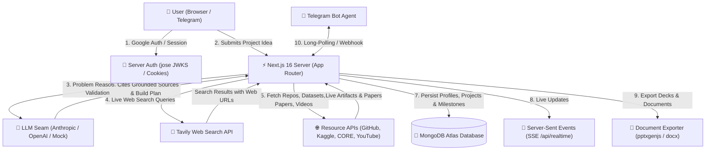

# Scrutan — Proof before you build.

Most AI tools will happily tell you your idea is brilliant. **Scrutan scrutinises it.**

Drop in a one-line idea and Scrutan scores how real the problem is, researches it against
live web sources, compares it against what already exists, and produces a buildable plan —
then **opens every citation it produced** to confirm the source is reachable and actually
says what it was cited for. The headline number on a Scrutan brief is not how good the idea
sounds; it is what fraction of its evidence survived being checked.

> Enter: _"Build an AI solution to reduce food waste in college hostels."_
> Get back: problem validation → research → solution comparison → innovation gaps →
> architecture → roadmap → tech stack → repos, APIs & datasets → timeline → deck-ready docs
> → **a grounding score over every source cited.**

### What it refuses to do

- **Invent a link.** The model is handed numbered search results and can only cite by
  number. It is never in a position to write a URL.
- **Flatter you.** Validation carries an explicit severity score, and the eval suite has
  eight cases whose pass condition is that a weak or crowded idea gets called weak.
- **Assert its own honesty.** Every claim above is checked by `npm run eval` against a
  30-case golden set, with baseline-relative regression detection — and the result is
  published, failures included, at `/quality`.

## Everything that ships

| Area | Scope |
|------|-------|
| **Validate** | Streamed problem validation with a severity score, refined problem statement and v1 scope |
| **Research** | DeepSearch over live web results, numbered citations, solution comparison, innovation gaps |
| **Verify** | Every cited URL fetched and classified `verified` / `mismatch` / `dead` / `unreachable` |
| **Check the claims** | Every sentence matched against passages from the source cited for it — with the supporting passage shown, or the fact that there isn't one |
| **Count the real sources** | *"12 citations, but 5 independent sources — 6 trace to one press release"* |
| **Watch it decay** | Stored checks re-run on a schedule: *"3 of the 12 sources have died since you wrote this"* — and, for pages still online, *"this one no longer contains the passage your claim was based on"* |
| **Plan** | Milestones, architecture, tech stack, API recommendations, timeline, knowledge clusters |
| **Check the plan** | The roadmap solved as a dependency graph: critical path, slack, and *"this says 8 weeks and needs 10"* |
| **Check itself** | 13 rules comparing validation, research and plan against each other — dangling citations, architecture wired to nothing, *"scored 3/10 and planned anyway"* |
| **Build with** | Real repos, datasets and papers from GitHub, Kaggle, CORE and YouTube |
| **Keep** | MongoDB-backed projects, version history, workspaces, comments, collaborators, live updates |
| **Share** | Public/unlisted briefs, `.pptx` / `.docx` / `.md` / PDF export, Notion and Google Docs push |
| **Audit a cohort** | Every idea in a workspace compared against every other; lookalikes grouped for a guide to read side by side |
| **Around it** | Orgs with domain join, plans and entitlements, Telegram agent, reminders, 8 languages |

## 🎯 Overview

**IdeaForge** is an AI-powered research and innovation copilot designed for hackathon participants, students, researchers, and first-time founders. It bridges the gap between having a raw project idea and knowing whether it is worth building—and how to execute it—in under 4 minutes.

Unlike generic conversational AI tools, IdeaForge grounds its analysis in **live web search results (Tavily)** and real external resources (open-source code on **GitHub**, datasets on **Kaggle**, academic preprints on **CORE / arXiv**, and tutorial videos on **YouTube**). It enforces strict citation integrity, rejecting invented URLs and providing deterministic scoring and structured technical build plans.

---

## 🚨 Problem Statement

1. **Unbounded & Exhaustive Research**: Builders spend 1–2 weeks opening 40+ browser tabs to perform market research, evaluate incumbents, and figure out tech stacks.
2. **AI Hallucinations & Unverifiable Links**: Generic LLMs confidently output fabricated web links, dead GitHub repositories, or fake citations.
3. **Flattery vs. Honest Evaluation**: Traditional AI chatbots approve almost any project idea, leading builders to waste months on over-crowded markets or mild, low-severity problems.
4. **Lack of Actionable Execution Plans**: Raw chat outputs do not provide structured milestone roadmaps, explicit tech stack rationales, or exportable deliverables (like pitch decks or Word documents).

---

## 💡 Solution

IdeaForge provides an automated, end-to-end pipeline that takes a single sentence and executes a multi-phase research & planning workflow:

- **Honest Severity Scoring**: Pushes back on weak, unhelpful, or over-saturated ideas with an explicit 1–10 Severity rating before any code is written.
- **Grounded Web Research with Zero Link Hallucinations**: Runs live web searches via Tavily, handing numbered source snippets to the LLM. The LLM cites claims with `[n]` markers, and the server constructs the citation list directly from real search results.
- **Resource Extraction**: Automatically queries specialized APIs (GitHub, Kaggle, CORE/arXiv, YouTube) to find real repositories, datasets, academic literature, and tutorial videos.
- **Actionable Build Roadmap**: Synthesizes a domain-tailored technical plan containing tech stack rationales, architecture components, time-boxed milestones with deliverables, and external APIs.
- **Multi-Channel Delivery & Export**: Work can be managed interactively via an in-app console or Telegram Bot (`/status`, `/next`, `/plan`), exported in 1-click to Microsoft PowerPoint (`.pptx`), Word (`.docx`), PDF, or Markdown, and shared with team members.

---

## ⭐ Key Features

| Feature | Description |
|---|---|
| **Problem Validation** | Restates the problem as a job-to-be-done, scores severity (1–10), identifies affected target users and economic buyers, lists evidence signals, and suggests a narrow v1 scope. |
| **DeepSearch Research** | Executes live multi-query web searches, writes a grounded briefing with `[n]` citation markers, identifies existing market incumbents with strengths/gaps, and highlights market opportunities. |
| **Project HUB Build Plan** | Generates a complete project blueprint with tech stack choices (with justifications), system architecture components, milestone roadmaps, and required APIs. |
| **Side-by-Side Idea Comparison** | Evaluates up to 3 ideas simultaneously across 4 axes (Severity, Reach, Feasibility, Differentiation). The code computes a weighted total to produce a deterministic ranking. |
| **Domain Problem Discovery** | Given a domain (e.g., *campus life*, *climate tech*), surfaces 4–6 real-world pain points grounded in live web signals, complete with starter project ideas. |
| **Deck & Document Critique** | Accepts uploaded PowerPoint (`.pptx`) decks or PDF documents, extracts text (via `jszip` / `pdfjs-dist`), and provides a score (0–100), verdict, strengths, missing items, and slide-by-slide fix notes. |
| **Multi-Channel AI Agent** | Interactive in-app console and Telegram Bot Agent (`/projects`, `/status`, `/next`, `/plan`) with context-grounded Q&A capabilities over saved projects. |
| **Workspace Collaboration & SSE** | Team workspace support with `@username` / email invites, project commenting, project version history, and real-time live updates via Server-Sent Events (SSE). |
| **1-Click Multi-Format Export** | Exports projects to presentation-ready Microsoft PowerPoint decks (`.pptx`), styled Microsoft Word documents (`.docx`), PDF view, or raw Markdown. |
| **Automated Quality & WCAG Testing** | Includes a built-in evaluation harness (`scripts/eval/run.mjs`) for LLM response quality & regression tracking, plus a WCAG AA contrast check script (`scripts/check-contrast.mjs`). |

---

## 🏗️ System Architecture

### Visual Diagram


### Sequence & Flow (Mermaid)


UI / API routes
      │
      ▼
lib/pipeline/*    ← the Scrutan pipeline (one method per stage)
      │            │
      ▼            ▼
lib/ai/*        lib/search/*   ← swappable AI provider + web-search provider
(OpenAI·Anthropic·Mock)        (Tavily·Mock)
```

- **`lib/ai`** — a tiny `AIProvider` interface (`streamText` / `generateText`) with three
  implementations. `getProvider()` auto-selects from env. The **Mock** provider synthesizes
  realistic output locally, so the whole app runs with **zero API keys**.
- **`lib/search`** — a `SearchProvider` interface powering DeepSearch. **Tavily** for live web
  results, **Mock** for offline demos (clearly labeled in the UI).
- **`lib/pipeline`** — `ScrutanPipeline` is the single seam every feature calls. Changing what
  powers a stage means editing only `lib/pipeline/index.ts`. Covers **problem discovery**
  (find real problems worth solving in a domain, grounded in live web signals), validation,
  DeepSearch, Project HUB, and knowledge clustering.
- **`lib/verify`** — the part the rest of the category doesn't have, in two layers.
  *Citations*: every URL is fetched, and the result is split three ways — reachable,
  relevant to the title it was cited under, and therefore verified; a dead link and a live
  page about something else are different failures, so they are reported apart.
  *Claims*: the harder question, and the one people assume the first answers. A real, live,
  on-topic source can still be attached to a sentence it never contained. So the briefing is
  cut into sentences (`segment.ts` — abbreviation-, decimal- and marker-aware, because
  `split(".")` is wrong in five ways that occur in ordinary output), each cited source is
  cut into overlapping passages (`chunk.ts`), both are embedded with the local model, and
  the best-matching passage becomes the evidence shown next to the claim.

  The thresholds are **measured, not chosen** (`npm run eval:claims`): 50 hand-labelled
  claim/passage pairs, swept, with the two cut-offs picked by a stated rule — the supported
  bar is the lowest with ≥95% precision, the weak bar the highest with ≥95% recall. That
  calibration produced the finding the design now turns on: **passages that contradict a
  claim score higher on average (0.554) than passages that genuinely paraphrase it (0.531)**,
  because an embedding encodes subject matter and a denial is about the same subject as the
  assertion it denies. No threshold can separate them, so the two catchable cases are
  checked literally instead — figures (including spelled-out ones, in either notation) and
  explicit refutations scoped to the claim's own subject. The cut-offs are stored **per
  model**, because the two embedders live in different numeric ranges and sharing a constant
  would put every claim below the weak bar on the fallback, telling every user their whole
  briefing was fabricated. An uncalibrated model produces no verdicts at all.

  *Drift* (`shingle.ts`, `evidence.ts`): link rot is the easy half. The harder failure is a
  page that stays up, keeps its URL and title, and quietly loses the paragraph that was
  cited — an edited statistic, a story rewritten in place. Catching it means comparing the
  page against what it used to be, which sounds like archiving every cited page forever. It
  is not: a SHA-256 answers "did anything change" in 32 bytes, and a 128-wide **MinHash
  sketch** over 5-word shingles estimates how much changed in ~512 bytes, without either
  document being present. So the store is half a kilobyte per source and never holds anyone
  else's text. Whether *your* passage survived is a separate question with a separate
  answer, taken from the claim check's own quotations — a page can be almost entirely
  rewritten and still contain the line you cited, or barely touched and have lost exactly
  it.

  *Independence* (`simhash.ts`, `independence.ts`): a briefing citing twelve URLs reads as
  though twelve parties looked at the question. Often six are one press release reprinted
  across trade sites and three are pages on one vendor's own domain, so the number of people
  who actually investigated anything is two. Nobody measures this, though it is the number
  that decides what a briefing is worth. Two collapses are checkable without a model — same
  registrable publisher (with a curated multi-part suffix list, so `bbc.co.uk` does not
  reduce to `co.uk`), and the same text republished elsewhere, caught by a 64-bit **SimHash**
  at a Hamming threshold measured from fixtures (reprints land 2–15 bits apart, independent
  writing 29–38; the cut-off sits at 18, near the low end of that gap because a false merge
  understates evidence someone actually has). Union-find over both link types gives the
  independent-source count, and normalised Shannon entropy over the publisher distribution
  gives the concentration figure.
- **`lib/similarity`** — embeddings behind the same kind of seam, powering "has someone
  already proposed this?" within a workspace. Two implementations with measured, documented
  behaviour: the neural one separates paraphrases from unrelated ideas, the lexical fallback
  demonstrably cannot, and it says so in the log rather than pretending.
- **`lib/plan`** — the same move as citation verification, applied to the roadmap. A model
  asked for a timeline produces something that *reads* like a schedule; nothing checks that
  milestone four can start when it says it does. Given the durations and dependencies the
  model declares, that is arithmetic — cycle detection by DFS colouring, Kahn's algorithm for
  the ordering, forward and backward passes for earliest/latest start and slack, longest path
  for the critical path. It reports loops, milestones scheduled before their prerequisites
  finish, dependencies that do not exist, and the one people care about: a plan whose own
  dependencies need more weeks than its labels claim. A plan predating the dependency field
  is sequenced as a chain and says so, because with an assumed chain everything is critical —
  a fact about the assumption, not about the plan.
- **`lib/verify/consistency.ts`** — a brief is produced by three separate calls and nothing
  ever compared them, so a project can score the problem 3/10 and carry a sixteen-week plan
  for building it; the narrative can cite `[7]` when six sources exist; the architecture can
  wire a component to one that was never defined. Each artifact is internally plausible,
  which is why nobody notices. Thirteen rules, each declaring which artifacts it needs so a
  half-finished project skips rather than misfires. Findings are tiered — a dangling citation
  is a `contradiction` because no reading of it is benign, while "the plan does not address
  one of the three gaps" is a `note`, since focus can be deliberate. Costs nothing (no
  network, no model), so unlike every other check it runs on every page load rather than
  behind a button.
- **`lib/email`** — swappable mailer (console dev / Resend prod) powering email verification,
  with a graceful fallback link when a real send can't be delivered.
- **`lib/db`** — **MongoDB** persistence, one repository module per aggregate. A project is a
  single document: its plan, research, milestone progress and workspace items are all embedded,
  so reads are one round-trip and deleting a project is atomic. Mutations go through Server
  Actions in `lib/actions.ts`. Set `MONGODB_URI`; indexes are created on first boot, and
  short-lived records (sessions, tokens, rate-limit hits) are reaped by TTL indexes.
- **`lib/auth`** — email + password authentication with **no external library**: passwords
  hashed with Node's `crypto.scrypt` (salted), opaque session tokens in an HttpOnly cookie
  backed by a `sessions` table. `getCurrentUser()` gates server components/actions; every
  project is scoped to its owner (`user_id`), so `getProject`/`listProjects` enforce
  authorization at the query level. Guests can use the copilot but must sign in to save.
- **`lib/agents`** — one channel-agnostic `handleAgentMessage()` brain powering both the in-app
  **Agent Console** (`/api/agents/message`) and a **Telegram webhook** (`/api/agents/telegram`).
  Commands (`/status`, `/next`, `/plan`, `/projects`) run locally; free-text is answered by the
  LLM grounded in the project's saved artifacts. Works with no token; connects a real bot when
  `TELEGRAM_BOT_TOKEN` is set (see `.env.example`).
- **`lib/billing`** — plans, entitlements, and the payment provider seam. `plans.ts` is the one
  table describing what each tier gets; `resolve.ts` answers "what plan is this user on?" by
  taking the better of their own subscription and their workspace's; `entitlements.ts` is the
  only place that answers "is this allowed?", so a gate can never be enforced in one route and
  forgotten in its sibling.
- **`lib/db/orgs` + `lib/orgs`** — organisations: a lab, class, or cohort on one plan. Members
  join automatically by verified email domain, and mentors can read and comment on the whole
  workspace's projects without being invited to each one. Domain claims are checked against the
  claimant's own address and public mailbox providers can never be claimed, which is what stops
  a domain claim from being a way to adopt strangers.
- **Public briefs** — a shared brief is unlisted by default; its owner can separately
  list it, which adds it to `/explore`, the sitemap, and search indexes. Everything else is
  `noindex` and the signed-in surface is disallowed by prefix in `robots.txt`, so a new
  private route is private without anyone remembering to add it.
- **Version history** — every regeneration snapshots what it replaced, so re-running
  validation no longer destroys the previous verdict. Rapid autosaves coalesce into one
  entry; a restore never does, because folding it in would discard the state being
  replaced and make the restore itself irreversible.
- **Multilingual** — an 8-language selector threads a BCP-47 `locale` through every prompt, so a
  live model responds in the chosen language across validation, research, plan, and the agent.

## Run it

## 🗄️ Database Architecture

IdeaForge uses **MongoDB Atlas** for persistence. Connections are managed via a single shared connection pool per process (`src/lib/db/index.ts`) with retry-cooldown logic to prevent connection stampedes on shared M0 clusters.

### Database Collections & Indexes

| Collection | Key Fields | Indexes & Constraints |
|---|---|---|
| `users` | `_id`, `email`, `name`, `username`, `passwordHash` | `email` (unique), `username` (unique, sparse) |
| `sessions` | `_id`, `userId`, `token`, `expiresAt` | `userId`, `expiresAt` (TTL index) |
| `projects` | `_id`, `userId`, `title`, `idea`, `plan`, `research`, `members`, `shareToken` | `(userId, updatedAt)`, `members.userId`, `shareToken` (unique, sparse), `(listed, listedAt)` |
| `projectInvites` | `_id`, `projectId`, `email`, `role`, `expiresAt` | `projectId`, `email`, `expiresAt` (TTL index) |
| `projectComments`| `_id`, `projectId`, `userId`, `content`, `createdAt` | `(projectId, createdAt)`, `userId` |
| `projectVersions` | `_id`, `projectId`, `snapshot`, `createdAt` | `(projectId, createdAt)` |
| `reminders` | `_id`, `projectId`, `userId`, `nextDueAt`, `active` | `(active, nextDueAt)`, `projectId`, `userId` |
| `watches` | `_id`, `userId`, `projectId`, `query`, `nextRunAt` | `(active, nextRunAt)`, `userId` |
| `watchFindings` | `_id`, `watchId`, `projectId`, `url`, `title` | `(watchId, url)` (unique), `(userId, seen, foundAt)` |
| `orgs` | `_id`, `slug`, `name`, `emailDomains`, `plan` | `slug` (unique), `emailDomains` (unique, partial), `providerSubscriptionId` (unique, sparse) |
| `orgMembers` | `_id`, `orgId`, `userId`, `role` | `userId` (unique), `(orgId, role)` |
| `rateHits` | `_id`, `userId`, `kind`, `createdAt`, `expiresAt` | `(userId, kind, createdAt)`, `expiresAt` (TTL index) |
| `telegramLinks` | `_id`, `userId`, `telegramChatId` | `userId` |
| `analyticsEvents`| `_id`, `name`, `day`, `properties`, `expiresAt` | `(name, createdAt)`, `day`, `expiresAt` (TTL index) |

---

## 🔒 Authentication & Security

1. **Server-Side Firebase ID Token Verification**:
   When signing in with Google, Firebase Auth on the client provides an ID Token. The server verifies the token against Google's official public JSON Web Key Sets (JWKS) (`https://www.googleapis.com/service_accounts/v1/jwk/...`) using `jose`.
   - Checks signature using RS256 algorithm.
   - Asserts `issuer` matches `https://securetoken.google.com/<FIREBASE_PROJECT_ID>`.
   - Asserts `audience` matches `<FIREBASE_PROJECT_ID>`.
   - Eliminates the need for storing private `firebase-admin` service account keys on the server.
2. **Session Security**:
   Authenticated sessions issue a secure, encrypted HTTP-only cookie (`ideaforge_session`) preventing client-side script theft (XSS mitigation).
3. **Password Security**:
   Email/password sign-up encrypts credentials using Node's native `crypto` PBKDF2 hashing with salt. Verification links and password reset tokens are single-use and auto-expire via MongoDB TTL indexes.
4. **Billing Production Safeguard**:
   Simulated billing (`/api/billing/simulate`) is strictly disabled in production environments unless explicitly opted in via `ALLOW_SIMULATED_BILLING=1`.

---

## 📡 API Reference

### Core AI & Pipeline APIs

#### `POST /api/analyze`
Streams real-time problem validation markdown for a submitted project idea.
- **Request Body**: `{ "idea": "string", "locale"?: "string" }`
- **Response**: Text stream (Server-Sent Event / Markdown chunks)

#### `POST /api/research`
Executes live Tavily web research and returns a cited research report.
- **Request Body**: `{ "idea": "string", "locale"?: "string" }`
- **Response**: JSON `{ "summaryMarkdown": "...", "existingSolutions": [...], "gaps": [...], "citations": [...] }`

#### `POST /api/plan`
Synthesizes a domain-tailored technical build plan.
- **Request Body**: `{ "idea": "string", "research"?: ResearchReport, "locale"?: "string" }`
- **Response**: JSON `{ "title": "...", "pitch": "...", "techStack": [...], "architecture": [...], "milestones": [...], "apis": [...] }`

#### `POST /api/compare`
Compares up to 3 candidate project ideas side-by-side.
- **Request Body**: `{ "ideas": ["idea 1", "idea 2", ...], "locale"?: "string" }`
- **Response**: JSON `{ "ideas": [...scores & verdicts...], "rationale": "..." }`

#### `POST /api/discover`
Surfaces real-world problems grounded in live search for a specific domain.
- **Request Body**: `{ "domain": "string", "locale"?: "string" }`
- **Response**: JSON `{ "problems": [...], "sources": [...] }`

#### `POST /api/review`
Critiques an uploaded pitch deck (`.pptx`) or PDF document.
- **Request Body**: `FormData` containing `file` (`.pptx` or `.pdf`)
- **Response**: JSON `{ "score": 85, "verdict": "...", "strengths": [...], "improvements": [...], "missing": [...], "sectionNotes": [...] }`

### Agent & Integration APIs

- `POST /api/agents/message`: In-app AI agent message endpoint.
- `POST /api/agents/telegram`: Telegram Bot webhook receiver.
- `GET /api/realtime`: Server-Sent Events (SSE) connection stream for workspace live sync.
- `GET /api/health`: System health check status reporting dependencies (`AI`, `Search`, `DB`).
- `POST /api/cron/reminders`: Cron job endpoint for firing milestone reminder notifications.

---

## ⚙️ Prerequisites

- **Node.js**: v20.0.0 or higher
- **Package Manager**: `npm` (v10+ recommended)
- **Database**: MongoDB Atlas instance (free M0 cluster or higher)

---

## 🔑 Environment Variables

Create a `.env.local` file in the root directory. Use the following template:

```env
# -----------------------------------------------------------------------------
# Database Configuration (Required)
# -----------------------------------------------------------------------------
MONGODB_URI=mongodb+srv://<USER>:<PASSWORD>@<CLUSTER>.mongodb.net/?retryWrites=true&w=majority
MONGODB_DB=ideaforge
MONGODB_MAX_POOL_SIZE=10

# -----------------------------------------------------------------------------
# AI Provider Credentials (At least one required, otherwise defaults to Mock)
# -----------------------------------------------------------------------------
# AI_PROVIDER=anthropic # Options: anthropic | openai | mock
ANTHROPIC_API_KEY=your_anthropic_api_key_here
ANTHROPIC_MODEL=claude-sonnet-4-5

OPENAI_API_KEY=your_openai_api_key_here
OPENAI_MODEL=gpt-4o-mini

# -----------------------------------------------------------------------------
# Live Search Engine (Recommended)
# -----------------------------------------------------------------------------
TAVILY_API_KEY=your_tavily_api_key_here

# -----------------------------------------------------------------------------
# Resource Integration APIs (Recommended)
# -----------------------------------------------------------------------------
GITHUB_TOKEN=your_github_personal_access_token
KAGGLE_API_KEY=your_kaggle_api_key
CORE_API_KEY=your_core_ac_uk_api_key
YOUTUBE_API_KEY=your_youtube_data_api_v3_key

# -----------------------------------------------------------------------------
# Authentication (Google Sign-In via Firebase)
# -----------------------------------------------------------------------------
FIREBASE_PROJECT_ID=your_firebase_project_id
NEXT_PUBLIC_FIREBASE_PROJECT_ID=your_firebase_project_id
NEXT_PUBLIC_FIREBASE_API_KEY=your_firebase_web_api_key

# -----------------------------------------------------------------------------
# Email Service (Resend for Email Verification & Password Resets)
# -----------------------------------------------------------------------------
RESEND_API_KEY=your_resend_api_key
EMAIL_FROM=IdeaForge <noreply@yourdomain.com>

# -----------------------------------------------------------------------------
# Telegram Bot Agent
# -----------------------------------------------------------------------------
TELEGRAM_BOT_TOKEN=your_telegram_bot_token
TELEGRAM_WEBHOOK_SECRET=your_telegram_webhook_secret
# DISABLE_BACKGROUND_WORKERS=1 # Set to 1 in local dev if deployed instance owns Telegram polling

# -----------------------------------------------------------------------------
# Billing & Payments (Razorpay)
# -----------------------------------------------------------------------------
RAZORPAY_KEY_ID=your_razorpay_key_id
RAZORPAY_KEY_SECRET=your_razorpay_key_secret
RAZORPAY_WEBHOOK_SECRET=your_razorpay_webhook_secret
ALLOW_SIMULATED_BILLING=1 # Enable only for demo environments

# -----------------------------------------------------------------------------
# Administration & Cron Secrets
# -----------------------------------------------------------------------------
ADMIN_USERNAMES=your_admin_username
CRON_SECRET=your_cron_secret_key
```

---

## 🚀 Local Development & Setup

1. **Clone the Repository**:
   ```bash
   git clone https://github.com/your-username/ideaforge.git
   cd ideaforge
   ```

2. **Install Dependencies**:
   ```bash
   npm install
   ```

3. **Configure Environment Variables**:
   Copy `.env.local` template above and fill in your API credentials.

4. **Run Database Smoke Test (Optional)**:
   Verify your MongoDB connection string and collection index setup:
   ```bash
   npm run test:db
   ```

5. **Start the Local Development Server**:
   ```bash
   npm run dev
   ```
   Open [http://localhost:3000](http://localhost:3000) in your browser.

---

## 🧪 Testing & Quality Evaluation

IdeaForge includes comprehensive evaluation and maintenance scripts:

### 1. AI Output Quality & Benchmark Evaluation
Runs the evaluation harness (`scripts/eval/run.mjs`) against the benchmark dataset (`scripts/eval/golden-set.json`):
```bash
# Run full evaluation suite (requires local running dev server and EVAL_COOKIE)
EVAL_COOKIE="ideaforge_session=your_session_cookie" npm run eval

# Run specific slice (e.g. honesty, ranking, robustness)
npm run eval:fast

# Update baseline metrics
npm run eval:baseline
```

### 2. Accessibility & Contrast Checking
Asserts WCAG 2.1 AA contrast compliance for all color tokens defined in `src/app/globals.css` and ensures raw Tailwind color classes do not bypass the theme layer:
```bash
npm run check:contrast
```

### 3. Database Migration & Tests
```bash
EVAL_COOKIE="scrutan_session=…" npm run eval            # all 30 cases
EVAL_COOKIE="…" npm run eval:publish                      # publish the scoreboard to /quality
EVAL_COOKIE="…" npm run eval:fast                         # deploy gate, no live search
EVAL_COOKIE="…" npm run eval -- --tag=grounding --repeat=3
EVAL_COOKIE="…" npm run eval:baseline                     # record the current run
```

---

## 🌐 Deployment

### Deploying to Render (Recommended for Persistent Background Workers)
Render hosts persistent Node.js instances, making it the simplest environment for running the Telegram long-poller and reminder scheduler without external crons.

1. **New Web Service**: Connect your GitHub repository to Render.
2. **Build & Start Commands**:
   - Build Command: `npm install && npm run build`
   - Start Command: `npm run start`
3. **Environment Variables**: Add all variables from your `.env.local` (ensure `MONGODB_URI` is set and `0.0.0.0/0` is allowed under MongoDB Atlas Network Access).

### Deploying to Vercel (Serverless Environment)
1. **Import Project**: Import repository into Vercel.
2. **Environment Variables**: Set required environment variables in Vercel Dashboard.
3. **Cron Jobs & Webhooks**:
   - `vercel.json` configures the cron job at `/api/cron/reminders` automatically.
   - Point your Telegram bot to the webhook URL using `curl`:
     ```bash
     curl "https://api.telegram.org/bot<BOT_TOKEN>/setWebhook?url=https://<your-app>.vercel.app/api/agents/telegram&secret_token=<WEBHOOK_SECRET>"
     ```

---

## 💡 Major Technical Decisions & Challenges

1. **Zero Link Hallucinations by Construction**:
   To prevent LLMs from generating broken or hallucinated URLs, the system never allows the LLM to write URLs directly. The search engine (Tavily) fetches raw web results, assigns numbered indices (`[1]`, `[2]`), and hands these to the prompt. The LLM returns citation markers, and the server constructs the citation payload exclusively from verified search results.
2. **Separation of LLM Scoring from Ranking**:
   In comparison mode, asking LLMs to score and rank ideas independently results in uniform 7/10 ratings ("everything is good"). IdeaForge forces the LLM to rate ideas relatively on 4 discrete axes, while a deterministic code algorithm computes weighted totals and orders the ranking.
3. **Serverless & Long-Polling Dual Worker Architecture**:
   The background agent handler automatically detects serverless environments (`VERCEL`) and switches between in-process `setInterval` / long-polling (Render/Local) and Vercel Cron / Webhook mechanisms.
4. **Lightweight Server-Side Token Verification (`jose`)**:
   By using `jose` to verify Google OAuth tokens against Google's public JWKS endpoint directly, the app avoids loading heavy SDKs (`firebase-admin`) and avoids storing private service-account keys in server memory.

---

## 🔮 Future Roadmap

- [ ] **Cumulative Per-User Spend Caps**: Implement daily sliding-window token budget limits per user tier.
- [ ] **Redis Pub/Sub SSE Scaling**: Upgrade Server-Sent Events from single-process memory fan-out to Redis Pub/Sub for multi-instance deployments.
- [ ] **Collaborative Live Workspace**: Enable multi-user simultaneous real-time editing on build plans.
- [ ] **Custom Domain White-Labeling**: Allow Campus & Enterprise clients to host IdeaForge under custom university/incubator subdomains.

---

## 📄 License

This project is proprietary and private software. All rights reserved.
